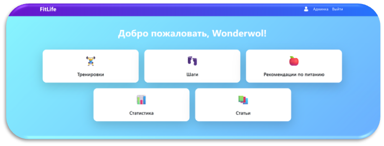
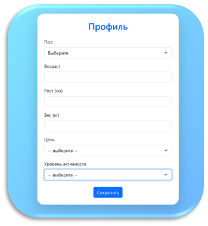
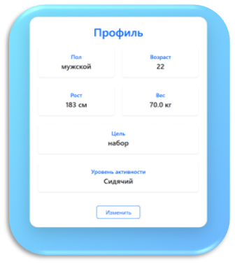
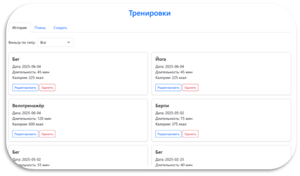
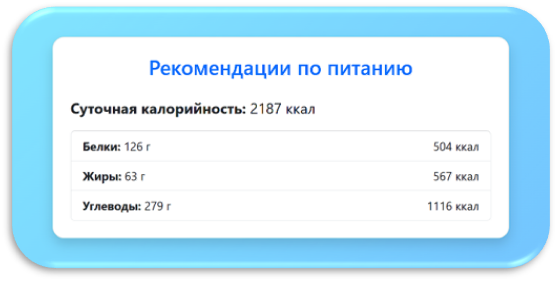
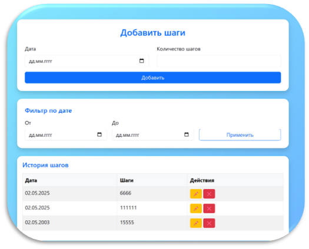
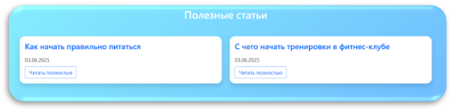
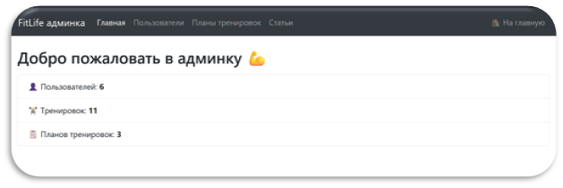

# FitLife: Персональная платформа для комплексной поддержки ЗОЖ

**Веб-платформа, объединяющая ключевые аспекты здорового образа жизни в едином пространстве.** Замена нескольким разрозненным приложениям для отслеживания тренировок, физической активности и питания.

## 🎯 Ключевые возможности

### 📊 **Централизованный мониторинг**
- **Тренировки**: Планирование, отслеживание и анализ спортивных активностей
- **Активность**: Мониторинг ежедневной физической активности (шаги, калории)
- **Питание**: Учёт потребления пищи, расчёт БЖУ, рекомендации по питанию

### 🛠 **Персонализация и удобство**
- Интуитивный интерфейс с адаптивным дизайном
- Персональные рекомендации на основе ваших данных
- Гибкие настройки под индивидуальные цели и предпочтения

### ⚡ **Технические преимущества**
- Единое пространство вместо нескольких приложений
- Масштабируемая архитектура для добавления новых функций

## 🏗️ Технологический стек

**Backend:**
- Python 3.12.3
- Flask — веб-фреймворк
- SQLAlchemy — работа с базой данных
- Flask-Login — аутентификация пользователей
- Flask-Migrate — миграции базы данных

**Frontend:**
- HTML5, CSS3, JavaScript
- Jinja2 — шаблонизатор
- Bootstrap — адаптивный дизайн

**База данных:**
- SQLite / PostgreSQL

**Инфраструктура:**
- Git — контроль версий
- Render — хостинг

## Демонстрация

### 🚀 Установка и запуск

# 1. Клонирование репозитория
git clone https://github.com/Wonderwol/DIPLOM.git
cd DIPLOM

# 2. Создание виртуального окружения
python -m venv venv
# Для Linux/Mac:
source venv/bin/activate
# Для Windows:
venv\Scripts\activate

# 3. Установка зависимостей
pip install -r requirements.txt

# 4. Настройка базы данных
flask db upgrade  # или python -m flask db upgrade

# 5. Запуск приложения
python app.py
